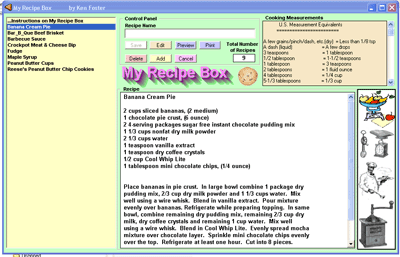



## My Recipe Box \(update\)

### Description

I made this for my wife to use. After looking at other programs, they where either too large or too complex or did'nt work (some cost big bucks), for what we needed.I've tried to keep it as simple and straight forward as possible. The print preview code is not mine, but seems to work good.Hope you give it a try. If you make any improvements,I would be interested in them. Credits given where needed.
 
### More Info
 

             |
---                |---
**Submitted On**   |2005-12-19 15:18:44
**By**             |[Kenneth Foster](https://github.com/Planet-Source-Code/PSCIndex/blob/master/ByAuthor/kenneth-foster.md)
**Level**          |Intermediate
**User Rating**    |5.0 (70 globes from 14 users)
**Compatibility**  |VB 6\.0
**Category**       |[Complete Applications](https://github.com/Planet-Source-Code/PSCIndex/blob/master/ByCategory/complete-applications__1-27.md)
**World**          |[Visual Basic](https://github.com/Planet-Source-Code/PSCIndex/blob/master/ByWorld/visual-basic.md)
**Archive File**   |[My\_Recipe\_19577912192005\.zip](https://github.com/Planet-Source-Code/kenneth-foster-my-recipe-box-update__1-63610/archive/master.zip)

